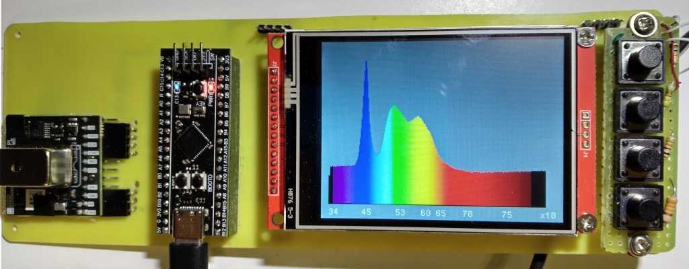

**The DIY_Spectrometer is visible light spectrometer based on Hamamatsu C12880MA sensor**

DIY project of Vis spectrometer based on compact and low cost sensor Hamamatsu C12880MA. Designed as an experimental device for investigating various application areas like environmental measurement, color measurement, quality control and information devices. The whole firmware is open-source and can be modified by anybody using the source code provided here.

